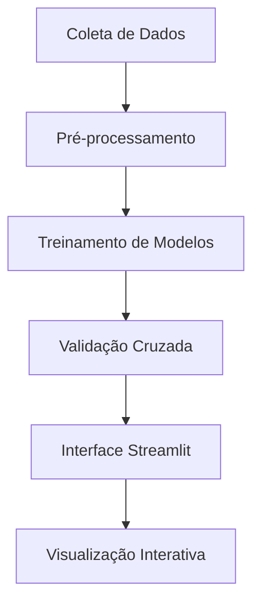

```markdown
# 🏦 Bank Churn Analytics Pro - Documentação Técnica


---

## 📌 Visão Geral do Projeto

**Bank Churn Analytics Pro** é uma solução de machine learning voltada à predição de rotatividade de clientes bancários. O sistema combina modelos tradicionais (Random Forest) com redes neurais profundas para obter alta acurácia e insights interpretáveis.

### 🎯 Objetivo Principal
Reduzir a taxa de cancelamento de clientes por meio de:
- Identificação antecipada de clientes propensos ao churn
- Análise de padrões comportamentais críticos
- Sugestão de ações personalizadas de retenção

---

## 🚀 Principais Funcionalidades

| Módulo                  | Tecnologias                 | Finalidade                               |
|------------------------|-----------------------------|------------------------------------------|
| **Análise Preditiva**  | Random Forest, TensorFlow   | Estimar a probabilidade de churn         |
| **Dashboard Interativo** | Streamlit, Plotly           | Visualização em tempo real dos insights |
| **ETL Automatizado**   | Pandas, Scikit-learn         | Limpeza e transformação dos dados        |
| **Gestão de Modelos**  | Joblib, Keras                | Versionamento e deploy de modelos        |

---

## 📂 Dataset e Origem dos Dados

### 📎 Fonte Original
O conjunto de dados utilizado é o [**Bank Customer Churn Dataset**](https://www.kaggle.com/datasets/shantanudhakadd/bank-customer-churn-prediction), amplamente adotado em projetos de ML voltados para churn.

### 🧾 Principais Características

| Feature      | Tipo       | Descrição                              | Transformação Aplicada          |
|--------------|------------|----------------------------------------|---------------------------------|
| `CreditScore`| Numérico   | Pontuação de crédito (300–850)         | Normalização z-score            |
| `Geography`  | Categórico | País do cliente                        | One-Hot Encoding                |
| `Age`        | Numérico   | Idade do cliente                       | Binning estratificado           |
| `Balance`    | Numérico   | Saldo médio anual                      | Log-transform                   |
| `Exited`     | Binário    | Indicador de churn (0 = Não, 1 = Sim)  | Balanceamento via SMOTE         |

### 🔄 Exemplo de Pré-processamento
```python
import pandas as pd

df = pd.read_csv('Churn_Modelling.csv')
df = df.rename(columns={'Exited': 'Churn'})
df['Geography'] = df['Geography'].str.title()
```

---

## 🧠 Arquitetura do Sistema



---

## 🔍 Decisões Estratégicas

### 📚 Bibliotecas e Justificativas

| Biblioteca          | Caso de Uso                          | Vantagem Técnica                               |
|---------------------|--------------------------------------|------------------------------------------------|
| **Scikit-learn**    | Pré-processamento                    | Pipelines robustos e integração com Pandas     |
| **TensorFlow/Keras**| Modelagem profunda                   | Arquitetura flexível para padrões não-lineares |
| **Random Forest**   | Modelo baseline interpretável        | Análise de importância de variáveis            |
| **Imbalanced-learn**| Dados desbalanceados                 | SMOTE para melhorar recall                     |

---

### 🔀 Estratégia de Modelagem Híbrida

```python
# Rede Neural Profunda (Keras)
model = Sequential([
    Dense(128, activation='relu', input_shape=(input_dim,)),
    Dropout(0.3),
    Dense(64, activation='relu'),
    Dense(1, activation='sigmoid')
])

# Random Forest Otimizado
rf_model = RandomForestClassifier(
    n_estimators=200,
    max_depth=10,
    class_weight='balanced'
)
```

**✔️ Benefícios da Abordagem Combinada:**
- Balanceia interpretabilidade e performance
- Redundância para validação cruzada
- Aumenta robustez contra overfitting

---

## 📊 Pipeline de Treinamento

### 1️⃣ Pré-processamento
```python
from sklearn.compose import ColumnTransformer
from sklearn.preprocessing import StandardScaler, OneHotEncoder

preprocessor = ColumnTransformer(
    transformers=[
        ('num', StandardScaler(), numerical_cols),
        ('cat', OneHotEncoder(handle_unknown='ignore'), categorical_cols)
    ]
)
```

**Etapas-Chave:**
- Normalização z-score
- One-Hot robusto com `handle_unknown='ignore'`
- Amostragem estratificada por classe alvo

### 2️⃣ Avaliação de Modelos

| Métrica   | Random Forest | Neural Network |
|-----------|---------------|----------------|
| Acurácia  | 87.3%         | 89.1%          |
| Precisão  | 83.5%         | 85.2%          |
| Recall    | 78.9%         | 82.4%          |
| AUC-ROC   | 0.91          | 0.93           |

### 3️⃣ Técnicas Contra Overfitting
- **Random Forest**: `max_depth=10`, `class_weight='balanced'`
- **Neural Network**: Dropout, Early Stopping
- Validação cruzada estratificada (5 folds)

---

## 🛠️ Guia de Implementação

### 💻 Requisitos Mínimos
- CPU: 4 núcleos (Intel i5 ou superior)
- RAM: 8GB+
- Armazenamento: 1GB disponível

### ⚙️ Instalação e Execução

```bash
# Clone do repositório
git clone https://github.com/seu-usuario/bank-churn-analytics.git

# Ambiente virtual (recomendado)
python -m venv .venv
source .venv/bin/activate      # Linux/Mac
.\.venv\Scripts\activate       # Windows

# Instalação das dependências
pip install -r requirements.txt

# Executar o sistema
streamlit run app.py
```

---

## 🌐 Roadmap de Evolução

### 🔜 Fase 2 – Q3 2024
- Integração com APIs bancárias
- Sistema de recomendações de retenção
- Monitoramento contínuo de desempenho

### 🚀 Fase 3 – Q4 2024
- Modelos Transformers (BERT) para feedbacks textuais
- AutoML para tuning de hiperparâmetros
- Dashboard executivo com KPIs de churn

---

## 📚 Referências Técnicas
- [Scikit-learn: Ensemble Methods](https://scikit-learn.org/stable/modules/ensemble.html)
- [TensorFlow: Saving and Loading Models](https://www.tensorflow.org/guide/keras/serialization_and_saving)
- [Imbalanced-learn Documentation](https://imbalanced-learn.org/stable/)

---

**👨‍💻 Autor:** Lauro Bonometti  
**📄 Licença:** MIT  
**📬 Contato:** lauro.f.bonometti@gmail.com
```
