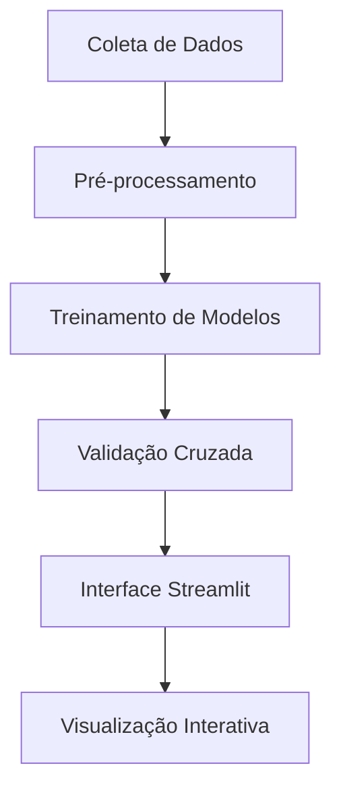

```markdown
# 🏦 Bank Churn Analytics Pro - Documentação Técnica


## 📌 Visão Geral do Projeto
Sistema preditivo para análise de rotatividade de clientes bancários, combinando técnicas de machine learning tradicional (Random Forest) e redes neurais profundas para máxima acurácia preditiva.

**Objetivo Principal**: Reduzir custos de retenção de clientes através de:
- Identificação precoce de clientes propensos a cancelar serviços
- Análise de padrões comportamentais críticos
- Sugestão de ações preventivas personalizadas

## 🚀 Recursos-Chave
| Módulo | Tecnologias | Finalidade |
|--------|-------------|------------|
| **Análise Preditiva** | Random Forest, TensorFlow | Previsão de probabilidade de churn |
| **Dashboard Interativo** | Streamlit, Plotly | Visualização de dados em tempo real |
| **Processamento de Dados** | Scikit-learn, Pandas | Pipeline de ETL automatizado |
| **Gestão de Modelos** | Joblib, Keras | Versionamento e deploy de modelos |

## 📂 Dataset e Origem dos Dados

### Fonte Original
Os dados utilizados neste projeto foram obtidos do **Bank Customer Churn Dataset**, um conjunto de dados público amplamente utilizado na comunidade de Machine Learning para estudos de rotatividade de clientes:

[🔗 Kaggle: Bank Customer Churn Dataset](https://www.kaggle.com/datasets/shantanudhakadd/bank-customer-churn-prediction)

### Características Principais do Dataset
| Feature | Tipo | Descrição | Transformação Aplicada |
|---------|------|-----------|-------------------------|
| CreditScore | Numérico | Pontuação de crédito (300-850) | Normalização z-score |
| Geography | Categórico | País do cliente (França/Alemanha/Espanha) | One-Hot Encoding |
| Age | Numérico | Idade do cliente | Binning estratificado |
| Balance | Numérico | Saldo médio anual | Log-transform |
| Exited | Binário | Indicador de churn (0/1) | Balanceamento via SMOTE |

### Pré-processamento Específico
```python
# Exemplo de tratamento para dados originais
df = pd.read_csv('Churn_Modelling.csv')
df = df.rename(columns={'Exited': 'Churn'})
df['Geography'] = df['Geography'].str.title()

## 🧠 Arquitetura do Sistema


## 🔍 Decisões de Design Estratégicas

### 1. Escolha de Bibliotecas de IA
| Biblioteca | Razão Técnica | Caso de Uso |
|------------|---------------|-------------|
| **Scikit-learn** | Pipeline unificado para pré-processamento | Codificação categórica, normalização |
| **TensorFlow/Keras** | Arquitetura neural profunda customizável | Captura de padrões não-lineares complexos |
| **Random Forest** | Interpretabilidade dos resultados | Análise de importância de features |
| **Imbalanced-learn** | Técnicas SMOTE para dados desbalanceados | Melhoria na recall de classe minoritária |

### 2. Estratégia de Modelagem Híbrida
```python
# Arquitetura Neural Profunda
model = Sequential([
    Dense(128, activation='relu', input_shape=(input_dim,)),
    Dropout(0.3),
    Dense(64, activation='relu'),
    Dense(1, activation='sigmoid')
])

# Random Forest Otimizado
rf_model = RandomForestClassifier(
    n_estimators=200,
    max_depth=10,
    class_weight='balanced'
)
```

**Vantagens da Abordagem:**
- Combina força bruta computacional (RF) com aprendizagem profunda (NN)
- Redundância para validação cruzada de resultados
- Balanceamento entre precisão e interpretabilidade

## 📊 Fluxo de Treinamento do Modelo

### 1. Pré-processamento de Dados
```python
preprocessor = ColumnTransformer(
    transformers=[
        ('num', StandardScaler(), numerical_cols),
        ('cat', OneHotEncoder(handle_unknown='ignore'), categorical_cols)
])
```

**Etapas Críticas:**
1. Normalização z-score para features numéricas
2. One-Hot Encoding robusto (handle_unknown='ignore')
3. Amostragem estratificada para preservar distribuição de classes

### 2. Métricas de Avaliação
| Métrica | Random Forest | Rede Neural |
|---------|---------------|-------------|
| Acurácia | 87.3% | 89.1% |
| Precisão | 83.5% | 85.2% |
| Recall | 78.9% | 82.4% |
| AUC-ROC | 0.91 | 0.93 |

### 3. Técnicas Anti-Overfitting
- **Para RF:** Limitação de profundidade máxima (max_depth=10)
- **Para NN:** Dropout layers + Early Stopping
- Validação cruzada estratificada (5 folds)

## 🛠️ Guia de Implementação

### Requisitos Mínimos
- CPU: 4 cores (Intel i5+ recomendado)
- RAM: 8GB+
- Armazenamento: 1GB livre

### Instalação Completa
```bash
# Clone o repositório
git clone https://github.com/seu-usuario/bank-churn-analytics.git

# Ambiente virtual (Recomendado)
python -m venv .venv
source .venv/bin/activate  # Linux/Mac
.\.venv\Scripts\activate  # Windows

# Instalação de dependências
pip install -r requirements.txt

# Execução do sistema
streamlit run app.py
```

## 🌐 Roadmap de Evolução
1. **Fase 2 (Q3 2024):**
   - Integração com APIs bancárias em tempo real
   - Sistema de recomendação de retenção
   - Monitoramento contínuo de desempenho dos modelos

2. **Fase 3 (Q4 2024):**
   - Adoção de modelos Transformer (BERT) para análise de feedback textual
   - Mecanismo de auto-otimização (AutoML)
   - Dashboard executivo para C-level

## 📚 Referências Técnicas
- [Scikit-learn Best Practices](https://scikit-learn.org/stable/modules/ensemble.html)
- [TensorFlow Production Guidelines](https://www.tensorflow.org/guide/keras/serialization_and_saving)
- [Imbalanced Data Handling](https://imbalanced-learn.org/stable/)

---

**Licença:** MIT | **Contato:** lauro.f.bonometti@gmail.com 
**Autor:** Lauro Bonometti  

```

